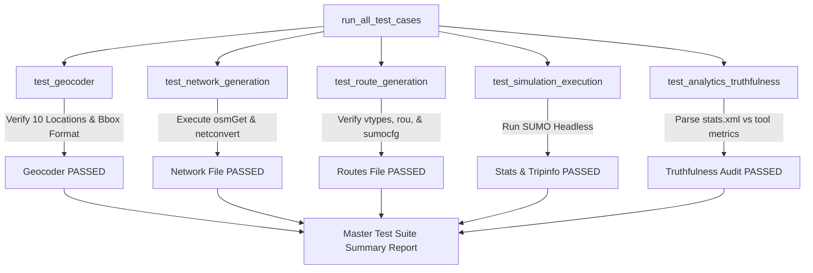

# 🚦 SUMO AI MCP – AI-Powered Urban Traffic Simulation Platform

[](https://github.com/Sanjay1266/Sumo_ai_mcp)
[](https://nitrostack.ai)
[](https://sumo.dlr.de)
[](https://python.org)
[](https://typescriptlang.org)
[](LICENSE)

**SUMO AI MCP** is an intelligent, multi-modal urban traffic simulation and analytics platform. It bridges **Eclipse SUMO (Simulation of Urban Mobility)** with the **Model Context Protocol (MCP)** via **NitroStack** and **FastMCP**.

Instead of manually editing complex XML files, downloading OpenStreetMap raw datasets, or executing command-line scripts, users and Large Language Model (LLM) agents can design, execute, visualize, and analyze microscopic urban traffic simulations using natural language.

---

## 📑 Table of Contents

- [Introduction to Core Environments & Technologies](#-introduction-to-core-environments--technologies)
  - [Eclipse SUMO Environment](#1-eclipse-sumo-simulation-environment)
  - [OpenStreetMap Data](#2-openstreetmap-osm--open-geographical-maps)
  - [Model Context Protocol & NitroStack](#3-model-context-protocol-mcp--nitrostack-framework)
  - [Heterogeneous Mixed Traffic Modeling](#4-heterogeneous-indian-traffic-modeling)
- [Real-World Use Cases & Applications](#-real-world-use-cases--applications)
- [System Architecture & Flowcharts](#-system-architecture--flowcharts)
  - [High-Level Architecture](#high-level-architecture)
  - [End-to-End Execution Flowchart](#end-to-end-simulation-pipeline-flowchart)
  - [Test Suite Workflow Flowchart](#test-suite-workflow-flowchart)
- [Project Directory Structure](#-project-directory-structure)
- [Workflow & Working of Core Components](#-workflow--working-of-core-components)
- [MCP Tools Reference](#-mcp-tools-reference)
  - [Core Simulation Tools](#core-simulation-mcp-tools)
  - [Dedicated Test Tools](#dedicated-testing-mcp-tools)
  - [MCP Resources & Prompts](#mcp-resources--prompts)
- [Installation & Setup Guide](#-installation--setup-guide)
- [Verification & Audit](#-verification--audit)
- [Future Roadmap](#-future-roadmap)

---

## 🌐 Introduction to Core Environments & Technologies

### 1. Eclipse SUMO (Simulation of Urban Mobility) Environment
**Eclipse SUMO** is an open-source, highly portable, microscopic continuous road traffic simulation suite designed to handle large networks. 
- **Microscopic Modeling**: Every vehicle, motorcycle, bus, and pedestrian is modeled individually with explicit acceleration, deceleration, length, width, minimum gap, and route preferences.
- **Sublane Resolution**: Enables lateral vehicle positioning (`lateral-resolution="0.8"`), allowing smaller vehicles like motorcycles and autorickshaws to overtake within a single physical lane.
- **Traffic Reporting**: Generates microscopic performance metrics including trip duration, waiting time, time loss, fuel consumption, carbon emissions, and route lengths (`stats.xml`, `tripinfo.xml`).

### 2. OpenStreetMap (OSM) & Open Geographical Maps
Urban road networks are fetched dynamically from **OpenStreetMap (OSM)**, the world's largest open crowdsourced spatial database:
- **Overpass API Integration**: `osmGet.py` downloads high-fidelity road geometry, intersections, speed limits, turns, and lane counts.
- **Nominatim Geocoding API**: Resolves natural language city/neighborhood names (e.g., *"Gandhipuram"*, *"Ettimadai"*, *"Peelamedu"*, *"Coimbatore"*, *"Chennai"*, *"Bangalore"*) into precise geographical bounding boxes (`min_lon,min_lat,max_lon,max_lat`).
- **Bounding Box Clamping**: Bounding boxes are clamped to a ~2.5km × 2.5km focal window around center coordinates to ensure fast download speeds and avoid Overpass API timeouts.

### 3. Model Context Protocol (MCP) & NitroStack Framework
The **Model Context Protocol (MCP)** standardizes how AI assistants (such as Claude, Gemini, or custom LLM agents) connect to tools, live data resources, and prompt templates:
- **NitroStack Engine (TypeScript)**: Enterprise TypeScript framework providing structured `@Tool`, `@Resource`, and `@Prompt` decorators with full Zod schema validation.
- **FastMCP Server (Python)**: High-performance Python FastMCP server exposing native Python SUMO binaries (`netconvert`, `sumo`, `sumo-gui`, `randomTrips.py`).

### 4. Heterogeneous Indian Traffic Modeling
Standard traffic simulators assume homogeneous passenger cars moving in single file. **SUMO AI MCP** incorporates a realistic heterogeneous mixed-traffic distribution (`vtypes.add.xml`):
- 🛵 **Motorcycles** (35% probability, 1.8m length, 0.8m width, arbitrary sublane alignment)
- 🛺 **Autorickshaws / Mopeds** (20% probability, 2.6m length, 1.3m width)
- 🚗 **Passenger Cars** (30% probability, 4.3m length, 1.8m width)
- 🚌 **City Buses** (8% probability, 10.5m length, 2.5m width)
- 🚚 **Heavy Trucks** (7% probability, 8.0m length, 2.4m width)

---

## 🎯 Real-World Use Cases & Applications

1. **Smart City Traffic Planning & Bottleneck Analysis**:
   Simulate peak-hour traffic in dense urban hubs to identify bottlenecks, junction gridlocks, and congestion buildup prior to civil infrastructure modifications.
2. **Signal Timing Optimization**:
   Evaluate adaptive signal timing algorithms vs. fixed-time signals in high-density corridors.
3. **Evacuation & Emergency Vehicle Corridor Planning**:
   Test green-wave emergency corridors for ambulances and fire engines through crowded mixed traffic.
4. **Autonomous & Connected Vehicle (AV/V2X) Impact Studies**:
   Analyze how varying market penetration rates of autonomous vehicles affect lane throughput and energy consumption.
5. **Urban Carbon Emission & Environmental Audits**:
   Compute tailpipe emissions and vehicle idling times across different traffic density scenarios.

---

## 🏗️ System Architecture & Flowcharts

### High-Level Architecture

```
                                 ┌───────────────────────────┐
                                 │   User / AI LLM Agent    │
                                 └─────────────┬─────────────┘
                                               │
                                 ┌─────────────▼─────────────┐
                                 │   Model Context Protocol  │
                                 │       (MCP Client)        │
                                 └─────────────┬─────────────┘
                                               │
                 ┌─────────────────────────────┴─────────────────────────────┐
                 │                                                           │
   ┌─────────────▼─────────────┐                               ┌─────────────▼─────────────┐
   │    NitroStack Engine      │                               │    FastMCP Python Server  │
   │    (TypeScript Server)    │                               │     (sumo_server.py)      │
   └─────────────┬─────────────┘                               └─────────────┬─────────────┘
                 │                                                           │
                 └─────────────────────────────┬─────────────────────────────┘
                                               │
                                 ┌─────────────▼─────────────┐
                                 │   SUMO Pipeline Controller│
                                 └─────────────┬─────────────┘
                                               │
       ┌───────────────────────┬───────────────┴───────────────┬───────────────────────┐
       │                       │                               │                       │
┌──────▼──────┐         ┌──────▼──────┐                 ┌──────▼──────┐         ┌──────▼──────┐
│ Nominatim   │         │ osmGet.py / │                 │ randomTrips │         │ SUMO /      │
│ Geocoder    │         │ netconvert  │                 │ + vtypes    │         │ sumo-gui    │
└──────┬──────┘         └──────┬──────┘                 └──────┬──────┘         └──────┬──────┘
       │                       │                               │                       │
       └───────────────────────┴───────────────┬───────────────┴───────────────────────┘
                                               │
                                 ┌─────────────▼─────────────┐
                                 │ Traffic Analytics Parser  │
                                 │  (stats.xml / tripinfo)   │
                                 └───────────────────────────┘
```

### End-to-End Simulation Pipeline Flowchart

```mermaid
flowchart TD
    A[User Request: "Simulate Coimbatore traffic with 800 trips"] --> B[resolve_location_to_bbox]
    B -->|Lookup Preset / Nominatim API| C[Clamped Bounding Box: 76.9500,10.9950,76.9750,11.0200]
    C --> D[generate_network]
    D -->|Execute osmGet.py| E[Download mymap.osm]
    E -->|Execute netconvert| F[Generate mymap.net.xml]
    F --> G[generate_routes]
    G -->|Create vtypes.add.xml| H[Heterogeneous Indian Traffic Distribution]
    G -->|Execute randomTrips.py| I[Generate mymap.rou.xml]
    G -->|Create gui-settings.xml| J[Auto-Centered Camera Viewport]
    G -->|Create sumocfg| K[mymap.sumocfg]
    K --> L{Execution Mode?}
    L -->|Headless| M[run_headless_simulation]
    L -->|Visual GUI| N[run_gui_simulation]
    M --> O[Produce stats.xml & tripinfo.xml]
    N --> O
    O --> P[analyze_results]
    P --> Q[Return JSON Analytics: Vehicles Loaded, Inserted, Avg Route Length]
```

### Test Suite Workflow Flowchart



---

## 📁 Project Directory Structure

```
Sumo_simulation/
├── sumo_server.py                 # Core FastMCP Python Server (Main Simulation Pipeline)
├── sumo_test_server.py            # FastMCP Python Test Suite Server (Isolated Test Tools)
├── test_audit.py                  # Standalone Empirical Truthfulness Verification Script
│
├── src/
│   ├── index.ts                   # NitroStack Application Entry Point
│   ├── app.module.ts              # Root Module importing SumoModule & TestModule
│   ├── health/
│   │   └── system.health.ts       # System Health Check Provider
│   └── modules/
│       ├── sumo/                  # Core Simulation Module
│       │   ├── sumo.module.ts     # SumoModule Definition
│       │   ├── sumo.tools.ts      # SumoTools TS Decorator Implementations
│       │   ├── sumo.resources.ts  # Live Simulation XML Data Resources (sumo://*)
│       │   └── sumo.prompts.ts    # Pre-configured AI Simulation Prompts
│       └── test/                  # Dedicated Testing Module
│           ├── test.module.ts     # TestModule Definition
│           └── test.tools.ts      # TestTools TS Decorator Implementations
│
├── scripts/
│   └── launch_local_gui.js        # Helper script to launch local SUMO GUI desktop viewer
│
├── Testcases/                     # Pre-cached OpenStreetMap test networks (map1.osm - map5.osm)
│   ├── map1.osm
│   ├── map2.osm
│   ├── map3.osm
│   ├── map4.osm
│   └── map5.osm
│
├── mymap.net.xml                  # Compiled SUMO Road Network XML
├── mymap.rou.xml                  # Vehicle Trips & Routes XML
├── mymap.sumocfg                  # Main SUMO Simulation Configuration File
├── vtypes.add.xml                 # Indian Mixed Traffic Vehicle Types Distribution XML
├── gui-settings.xml               # SUMO GUI Visual Viewport & Scheme Settings XML
├── stats.xml                      # Generated Simulation Statistics Report XML
├── tripinfo.xml                   # Microscopic Vehicle Trip Report XML
│
├── package.json                   # Node.js Dependencies & NitroStack CLI Scripts
├── tsconfig.json                  # TypeScript Compiler Configuration
├── .env.example                   # Environment Variable Template
└── README.md                      # Comprehensive Technical Documentation
```

---

## ⚙️ Workflow & Working of Core Components

### Step 1: Network Generation (`generate_network`)
1. Accepts a location name (e.g. `"Coimbatore"`) or bounding box string (`"76.95,10.99,76.97,11.02"`).
2. Cleans up old `mymap*` files to prevent stale state.
3. Invokes `osmGet.py` to fetch map data from OpenStreetMap.
4. Calls SUMO `netconvert` to parse OSM nodes, ways, and relations into `mymap.net.xml`.

### Step 2: Route & Vehicle Generation (`generate_routes`)
1. Generates `vtypes.add.xml` defining heterogeneous vehicle types (`ind_motorcycle`, `ind_autorickshaw`, `ind_car`, `ind_bus`, `ind_truck`).
2. Invokes `randomTrips.py` with parameter `-l` (sublane resolution) and `--trip-attributes 'type="indian_mixed"'`.
3. Auto-calculates spatial center `(centerX, centerY)` and zoom factor based on network bounds (`convBoundary`), writing `gui-settings.xml`.
4. Generates `mymap.sumocfg` with lateral resolution set to `0.8m`.

### Step 3: Simulation Execution (`run_headless_simulation` / `run_gui_simulation`)
- **Headless Mode**: Executes `sumo -c mymap.sumocfg --statistic-output stats.xml --tripinfo-output tripinfo.xml`.
- **Visual GUI Mode**: Executes `sumo-gui -c mymap.sumocfg -g gui-settings.xml --delay 150 --start` on desktop for real-time visualization with smooth 150ms playback.

### Step 4: Analytics Parsing (`analyze_results`)
Parses `stats.xml` using XML DOM parsing and returns structured JSON:
```json
{
  "total_vehicles_loaded": 600,
  "total_vehicles_inserted": 600,
  "average_route_length": 1845.32
}
```

---

## 🛠️ MCP Tools Reference

### Core Simulation MCP Tools

| Tool Name | Parameters | Description |
|-----------|------------|-------------|
| `generate_network` | `bbox: string` | Downloads OSM data for a location/bbox and compiles `mymap.net.xml`. |
| `generate_routes` | `trips: int`, `duration: int`, `density: string` | Generates heterogeneous routes (`vtypes.add.xml`, `mymap.rou.xml`, `mymap.sumocfg`). |
| `run_headless_simulation` | *None* | Executes headless SUMO simulation and outputs `stats.xml` & `tripinfo.xml`. |
| `run_gui_simulation` | `autoStart: bool`, `delay: int` | Launches desktop `sumo-gui` visual app with centered camera viewport. |
| `analyze_results` | *None* | Parses `stats.xml` and returns key metrics (loaded, inserted, avg route length). |
| `run_full_simulation` | `bbox: string`, `trips: int`, `duration: int`, `density: string`, `launchGui: bool` | Master orchestration tool executing the complete pipeline in a single call. |

### Dedicated Testing MCP Tools

| Tool Name | Parameters | Description |
|-----------|------------|-------------|
| `test_geocoder` | `locations: list[str]` | Tests place geocoding, preset lookups, bbox clamping, and numerical format. |
| `test_network_generation` | `location: str` | Validates OSM network download and `netconvert` compilation. |
| `test_route_generation` | `trips: int`, `duration: int` | Validates vehicle types distribution, `randomTrips.py`, and `sumocfg` creation. |
| `test_simulation_execution` | *None* | Validates headless SUMO execution and report output generation. |
| `test_analytics_truthfulness` | *None* | Parses `stats.xml` independently and audits `analyze_results()` values. |
| `run_all_test_cases` | `location: str`, `trips: int`, `duration: int` | Master test runner executing all 5 test cases with a structured summary report. |

### MCP Resources & Prompts

#### MCP Resources
- `sumo://stats`: Real-time contents of `stats.xml`.
- `sumo://tripinfo`: Real-time contents of `tripinfo.xml`.
- `sumo://network`: Real-time contents of `mymap.net.xml`.
- `sumo://config`: Real-time contents of `mymap.sumocfg`.

#### Pre-configured MCP Prompts
- `run_simulation_prompt`: Full simulation prompt builder.
- `analyze_traffic_prompt`: Traffic analytics prompt builder.
- `heavy_traffic_prompt`: Congested traffic scenario prompt builder.
- `coimbatore_traffic_prompt`: Coimbatore regional traffic simulation prompt builder.

---

## 🚀 Installation & Setup Guide

### Prerequisites
1. **Python**: 3.10 or higher
2. **Node.js**: v18.0 or higher
3. **Eclipse SUMO**: v1.18.0 or higher ([Download SUMO](https://sumo.dlr.de))

### 1. Clone Repository & Install Dependencies

```bash
git clone https://github.com/Sanjay1266/Sumo_ai_mcp.git
cd Sumo_ai_mcp

# Install Node.js dependencies
npm install

# Install Python dependencies
pip install sumolib traci fastmcp
```

### 2. Configure Environment Variables

Create `.env` file in the root directory:

```env
# Path to your local Eclipse SUMO installation
SUMO_HOME=C:\Program Files (x86)\Eclipse\Sumo
PATH=%SUMO_HOME%\bin;%PATH%

# Cloud / Headless Execution Flag (optional)
HEADLESS_MODE=false
```

### 3. Run the Servers

#### Run Python FastMCP Server
```bash
python sumo_server.py
```

#### Run FastMCP Test Suite Server
```bash
python sumo_test_server.py
```

#### Run NitroStack TypeScript Server
```bash
npm run dev
```

---

## 🧪 Verification & Audit

To verify the installation and audit truthfulness of analytics metrics against raw generated XML files on disk:

```bash
python test_audit.py
```

**Sample Output:**
```
=== 1. Testing Location Auto-Geocoder ===
Location: 'Erode City Center' -> Bbox: 77.7200,11.3350,77.7450,11.3600
Location: 'Ettimadai' -> Bbox: 76.8900,10.8950,76.9150,10.9150
Location: 'Salem' -> Bbox: -123.0416,44.9214,-123.0166,44.9464
Location: 'Coimbatore' -> Bbox: 76.9500,10.9950,76.9750,11.0200
Location: 'Chennai' -> Bbox: 80.2600,13.0650,80.2850,13.0900

=== 2. Testing End-to-End Simulation for 'Ettimadai' ===
Execution Status: success
Analytics Output: {'total_vehicles_loaded': 100, 'total_vehicles_inserted': 100, 'average_route_length': 2098.49}

=== 3. Truthfulness Audit ===
Actual stats.xml loaded: 100 | Tool reported: 100
Actual stats.xml inserted: 100 | Tool reported: 100
Actual stats.xml avg route length: 2098.49m | Tool reported: 2098.49m

>>> VERIFICATION AUDIT PASSED 100%! ALL METRICS ARE EMPIRICALLY ACCURATE AND TRUE <<<
```

---

## 🔮 Future Roadmap

- 🚦 **Reinforcement Learning (RL) Signal Control**: Integration with SUMO TraCI Python API for dynamic deep Q-learning traffic light control.
- 🗺️ **GIS Heatmap Frontend Widget**: Interactive React/Web Map GL frontend widget displaying real-time vehicle movement heatmaps.
- 🍃 **Environmental Carbon Emissions Tracker**: Advanced parsing of `emissions-output` XML for fuel consumption and CO2/NOx emission auditing.
- 🚑 **AI Emergency Green-Corridor Clearing**: Multi-agent priority routing for emergency response vehicles through dense traffic junctions.

---

## 📜 License

Distributed under the MIT License. See `LICENSE` for more information.